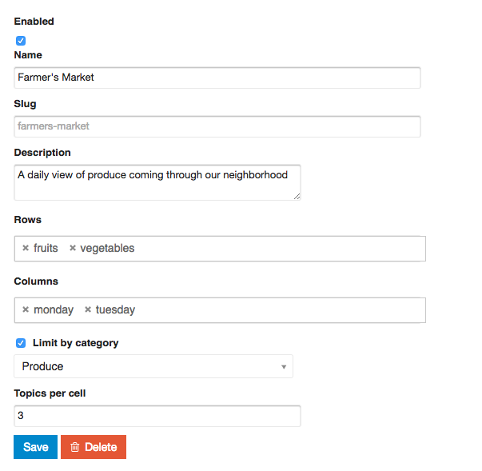
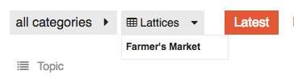
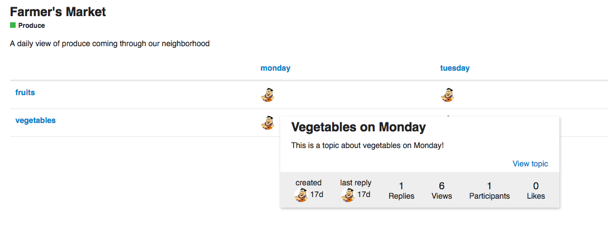

Bidirectional navigation tables for [Discourse](http://discourse.org)

This plugin allows a table of topics to be created, allowing for easy access to a large number of related topics in an easy-to-digest format. Topics are arranged by tags, and can optionally be limited by category.

#### Installation
 - Edit your web template and add the project clone url. (https://meta.discourse.org/t/install-a-plugin/19157)
 - Rebuild your web container so that the plugin installs.

#### Creating a lattice
- Visit the admin panel (`/admin/lattices/`)
- Fill out the form with a name, description, and tags for each row and column of the table
- Optionally, you can limit topics which appear by category
- Be sure to set enabled to true!

#### Viewing a lattice
On the home screen, a dropdown will appear next to the categories dropdown, providing links to all enabled lattices

Once viewing a lattice, you can either click on a user avatar to get a quick overview of the topic:

Or, ctrl+click to go directly there.

You can see a discussion of the intended functionality [here](https://meta.discourse.org/t/paid-fullstack-dev-for-bidimensionnal-navigation/45388).

As always, feedback is very welcome either by [filing an issue](http://www.github.com/gdpelican/lattice/issues), or by sending me a message [on Discourse meta](https://meta.discourse.org/users/gdpelican) Code contributions welcome!
